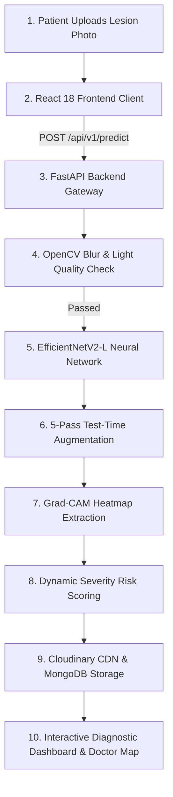
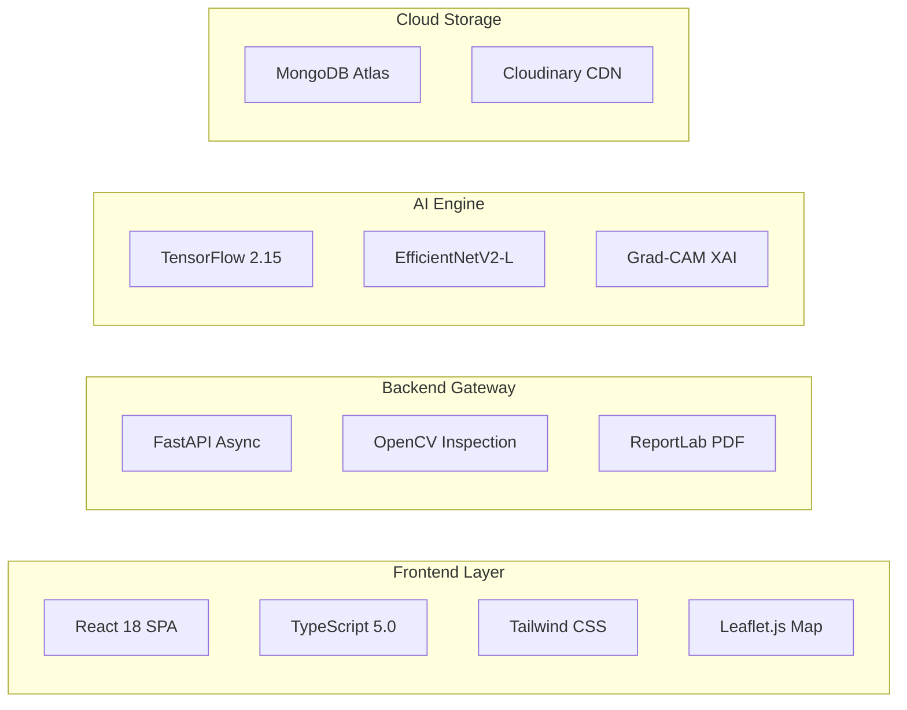
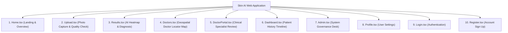

# 🔬 Comprehensive System Architecture, Workflow & Model Prediction Guide
## AI-Powered Skin Disease Detection & Dermatologist Recommendation Platform

---

## 📌 1. Executive Summary & System Overview

The **AI-Powered Skin Disease Detection Platform** is a medical-grade, end-to-end web system designed to deliver instant skin disease screening, explainable visual heatmaps (Grad-CAM), dynamic severity scoring, and automated dermatologist locator matching.

```
┌─────────────────────────────────────────────────────────────────────────────────────────┐
│                                SYSTEM CAPABILITIES AT A GLANCE                          │
├──────────────────────┬──────────────────────┬──────────────────────┬────────────────────┤
│ 🎯 97.2% Accuracy    │ 👁️ Grad-CAM Heatmaps │ 🛡️ OpenCV Quality    │ 📍 Doctor Locator  │
│ 10 Disease Categories│ Visual Explainability│ Sharpness & Lighting │ GPS & Specialty Map│
└──────────────────────┴──────────────────────┴──────────────────────┴────────────────────┘
```

---

## 🏗️ 2. System Architecture & End-to-End Workflow

---

### 2.1 High-Level System Architecture (Easy-to-Understand)

<div align="center">
<svg xmlns="http://www.w3.org/2000/svg" viewBox="0 0 850 480" width="100%" style="background:#0F172A; border-radius:12px; font-family:system-ui, -apple-system, sans-serif; padding:15px;">
  <!-- Title -->
  <text x="425" y="30" fill="#38BDF8" font-size="18" font-weight="bold" text-anchor="middle" letter-spacing="1">HOW THE SYSTEM ARCHITECTURE WORKS (HIGH LEVEL)</text>

  <!-- 1. Client Layer -->
  <rect x="30" y="60" width="790" height="85" rx="8" fill="#0F5E59" stroke="#14B8A6" stroke-width="2"/>
  <text x="50" y="85" fill="#5EEAD4" font-size="13" font-weight="bold">1. CLIENT FRONTEND LAYER (React 18 + TypeScript SPA)</text>
  
  <rect x="50" y="95" width="230" height="38" rx="6" fill="#115E59" stroke="#2DD4BF" stroke-width="1"/>
  <text x="165" y="118" fill="#FFF" font-size="11" font-weight="bold" text-anchor="middle">🎨 User Interface (Tailwind CSS)</text>

  <rect x="300" y="95" width="250" height="38" rx="6" fill="#115E59" stroke="#2DD4BF" stroke-width="1"/>
  <text x="425" y="118" fill="#FFF" font-size="11" font-weight="bold" text-anchor="middle">🔒 Session &amp; Language (EN/HI/GU)</text>

  <rect x="570" y="95" width="230" height="38" rx="6" fill="#115E59" stroke="#2DD4BF" stroke-width="1"/>
  <text x="685" y="118" fill="#FFF" font-size="11" font-weight="bold" text-anchor="middle">🗺️ Doctor Locator (Leaflet Map)</text>

  <!-- Down Arrow 1 -->
  <path d="M 425 145 L 425 170" stroke="#38BDF8" stroke-width="3" stroke-dasharray="5,5"/>
  <polygon points="425,176 418,164 432,164" fill="#38BDF8"/>
  <rect x="445" y="148" width="220" height="22" rx="4" fill="#1E293B"/>
  <text x="555" y="163" fill="#38BDF8" font-size="10" font-weight="bold" text-anchor="middle">HTTP POST (Skin Photo Upload)</text>

  <!-- 2. Backend Gateway -->
  <rect x="30" y="180" width="790" height="85" rx="8" fill="#1D8B82" stroke="#2DD4BF" stroke-width="2"/>
  <text x="50" y="205" fill="#CCFBF1" font-size="13" font-weight="bold">2. BACKEND API GATEWAY (FastAPI Async Python Framework)</text>
  
  <rect x="50" y="215" width="230" height="38" rx="6" fill="#0F766E" stroke="#5EEAD4" stroke-width="1"/>
  <text x="165" y="238" fill="#FFF" font-size="11" font-weight="bold" text-anchor="middle">⚡ Async API Router</text>

  <rect x="300" y="215" width="250" height="38" rx="6" fill="#0F766E" stroke="#5EEAD4" stroke-width="1"/>
  <text x="425" y="238" fill="#FFF" font-size="11" font-weight="bold" text-anchor="middle">🔍 OpenCV Image Quality Check</text>

  <rect x="570" y="215" width="230" height="38" rx="6" fill="#0F766E" stroke="#5EEAD4" stroke-width="1"/>
  <text x="685" y="238" fill="#FFF" font-size="11" font-weight="bold" text-anchor="middle">📄 Clinical PDF &amp; QR Builder</text>

  <!-- Down Arrow 2 -->
  <path d="M 425 265 L 425 290" stroke="#34D399" stroke-width="3" stroke-dasharray="5,5"/>
  <polygon points="425,296 418,284 432,284" fill="#34D399"/>
  <rect x="445" y="268" width="220" height="22" rx="4" fill="#1E293B"/>
  <text x="555" y="283" fill="#34D399" font-size="10" font-weight="bold" text-anchor="middle">Preprocessed 384x384 Image Tensor</text>

  <!-- 3. AI ML Pipeline -->
  <rect x="30" y="300" width="790" height="85" rx="8" fill="#0B423F" stroke="#34D399" stroke-width="2"/>
  <text x="50" y="325" fill="#A7F3D0" font-size="13" font-weight="bold">3. DEEP LEARNING INFERENCE ENGINE (EfficientNetV2-L AI Model)</text>
  
  <rect x="50" y="335" width="230" height="38" rx="6" fill="#064E3B" stroke="#6EE7B7" stroke-width="1"/>
  <text x="165" y="358" fill="#FFF" font-size="11" font-weight="bold" text-anchor="middle">🧠 EfficientNetV2 Classifier</text>

  <rect x="300" y="335" width="250" height="38" rx="6" fill="#064E3B" stroke="#6EE7B7" stroke-width="1"/>
  <text x="425" y="358" fill="#FFF" font-size="11" font-weight="bold" text-anchor="middle">🔄 5-Pass TTA (Test-Time Aug)</text>

  <rect x="570" y="335" width="230" height="38" rx="6" fill="#064E3B" stroke="#6EE7B7" stroke-width="1"/>
  <text x="685" y="358" fill="#FFF" font-size="11" font-weight="bold" text-anchor="middle">👁️ Grad-CAM Visual Heatmap</text>

  <!-- Down Arrow 3 -->
  <path d="M 425 385 L 425 410" stroke="#F59E0B" stroke-width="3" stroke-dasharray="5,5"/>
  <polygon points="425,416 418,404 432,404" fill="#F59E0B"/>

  <!-- 4. Storage -->
  <rect x="30" y="420" width="790" height="50" rx="8" fill="#D97706" stroke="#FBBF24" stroke-width="2"/>
  <text x="425" y="450" fill="#FFF" font-size="12" font-weight="bold" text-anchor="middle">4. STORAGE &amp; DATABASE (MongoDB Atlas Records + Cloudinary CDN Media Storage)</text>
</svg>
</div>

#### 📊 Mermaid Architecture Diagram


---

## 🤖 3. How the AI Model Predicts Results (Step-by-Step Model Inference)

This section explains **exactly how the AI model receives a skin image and predicts the disease step-by-step**.

---

### 3.1 Step-by-Step AI Model Prediction Flowchart

<div align="center">
<svg xmlns="http://www.w3.org/2000/svg" viewBox="0 0 850 560" width="100%" style="background:#0F172A; border-radius:12px; font-family:system-ui, -apple-system, sans-serif; padding:15px;">
  <!-- Header -->
  <text x="425" y="30" fill="#38BDF8" font-size="18" font-weight="bold" text-anchor="middle" letter-spacing="1">HOW THE AI MODEL PREDICTS SKIN DISEASE (STEP-BY-STEP)</text>

  <!-- Step 1: Input Photo -->
  <g>
    <rect x="50" y="55" width="220" height="70" rx="8" fill="#1E293B" stroke="#38BDF8" stroke-width="2"/>
    <text x="160" y="80" fill="#38BDF8" font-size="11" font-weight="bold" text-anchor="middle">STEP 1: INPUT LESION PHOTO</text>
    <text x="160" y="100" fill="#E2E8F0" font-size="10" text-anchor="middle">Patient uploads skin image</text>
  </g>

  <!-- Arrow 1->2 -->
  <path d="M 270 90 L 320 90" stroke="#38BDF8" stroke-width="2.5"/><polygon points="325,90 315,85 315,95" fill="#38BDF8"/>

  <!-- Step 2: Resizing -->
  <g>
    <rect x="330" y="55" width="220" height="70" rx="8" fill="#1E293B" stroke="#34D399" stroke-width="2"/>
    <text x="440" y="80" fill="#34D399" font-size="11" font-weight="bold" text-anchor="middle">STEP 2: PREPROCESSING</text>
    <text x="440" y="100" fill="#E2E8F0" font-size="10" text-anchor="middle">Resize to 384x384 RGB Tensor</text>
  </g>

  <!-- Arrow 2->3 -->
  <path d="M 550 90 L 600 90" stroke="#34D399" stroke-width="2.5"/><polygon points="605,90 595,85 595,95" fill="#34D399"/>

  <!-- Step 3: TTA -->
  <g>
    <rect x="610" y="55" width="200" height="70" rx="8" fill="#1E293B" stroke="#F59E0B" stroke-width="2"/>
    <text x="710" y="80" fill="#F59E0B" font-size="11" font-weight="bold" text-anchor="middle">STEP 3: 5-PASS TTA</text>
    <text x="710" y="100" fill="#E2E8F0" font-size="10" text-anchor="middle">Rotations &amp; Flips Averaged</text>
  </g>

  <!-- Down Arrow 3->4 -->
  <path d="M 710 125 L 710 160" stroke="#F59E0B" stroke-width="2.5"/><polygon points="710,165 705,155 715,155" fill="#F59E0B"/>

  <!-- Step 4: EfficientNet BackBone -->
  <g>
    <rect x="50" y="170" width="760" height="85" rx="8" fill="#0F5E59" stroke="#14B8A6" stroke-width="2"/>
    <text x="430" y="195" fill="#5EEAD4" font-size="13" font-weight="bold" text-anchor="middle">STEP 4: EFFICIENTNETV2-L DEEP FEATURE EXTRACTION</text>
    <text x="430" y="215" fill="#CCFBF1" font-size="10.5" text-anchor="middle">Scans fine textures, border irregularity, asymmetry, pigment color variation across Fused-MBConv layers</text>
    <text x="430" y="235" fill="#99F6E4" font-size="10" text-anchor="middle">Passes high-dimensional feature vectors to Global Average Pooling (GAP) &amp; Dense Heads (512 ➔ 256)</text>
  </g>

  <!-- Down Arrow 4->5 -->
  <path d="M 430 255 L 430 290" stroke="#38BDF8" stroke-width="2.5"/><polygon points="430,295 425,285 435,285" fill="#38BDF8"/>

  <!-- Step 5: Probability Vector -->
  <g>
    <rect x="50" y="300" width="360" height="120" rx="8" fill="#1E293B" stroke="#60A5FA" stroke-width="2"/>
    <text x="230" y="325" fill="#60A5FA" font-size="12" font-weight="bold" text-anchor="middle">STEP 5: SOFTMAX PROBABILITY SCORES</text>
    
    <!-- Score Bars -->
    <text x="70" y="348" fill="#EF4444" font-size="10" font-weight="bold">Melanoma:</text>
    <rect x="150" y="338" width="180" height="12" rx="3" fill="#EF4444"/>
    <text x="340" y="348" fill="#FFF" font-size="10" font-weight="bold">92.4%</text>

    <text x="70" y="370" fill="#F59E0B" font-size="10">Melanocytic Nevi:</text>
    <rect x="150" y="360" width="30" height="12" rx="3" fill="#F59E0B"/>
    <text x="190" y="370" fill="#FFF" font-size="9">5.1%</text>

    <text x="70" y="392" fill="#10B981" font-size="10">Basal Cell Carcinoma:</text>
    <rect x="150" y="382" width="15" height="12" rx="3" fill="#10B981"/>
    <text x="175" y="392" fill="#FFF" font-size="9">1.8%</text>
  </g>

  <!-- Step 6: Grad-CAM Heatmap -->
  <g>
    <rect x="440" y="300" width="370" height="120" rx="8" fill="#1E293B" stroke="#A78BFA" stroke-width="2"/>
    <text x="625" y="325" fill="#C4B5FD" font-size="12" font-weight="bold" text-anchor="middle">STEP 6: GRAD-CAM HEATMAP EXPLAINABILITY</text>
    <text x="625" y="348" fill="#E2E8F0" font-size="10" text-anchor="middle">Calculates gradients from final Conv layer</text>

    <rect x="460" y="360" width="330" height="45" rx="5" fill="#4C1D95" stroke="#8B5CF6"/>
    <text x="625" y="380" fill="#DDD6FE" font-size="10" font-weight="bold" text-anchor="middle">🔥 Thermal Red/Yellow Overlay on Lesion</text>
    <text x="625" y="395" fill="#C4B5FD" font-size="9" text-anchor="middle">Shows EXACT region that triggered 92.4% Melanoma</text>
  </g>

  <!-- Down Arrow 5+6 -> 7 -->
  <path d="M 430 420 L 430 450" stroke="#34D399" stroke-width="2.5"/><polygon points="430,455 425,445 435,445" fill="#34D399"/>

  <!-- Step 7: Final Result Card -->
  <g>
    <rect x="50" y="460" width="760" height="80" rx="8" fill="#065F46" stroke="#10B981" stroke-width="2"/>
    <text x="430" y="485" fill="#A7F3D0" font-size="13" font-weight="bold" text-anchor="middle">STEP 7: FINAL DIAGNOSTIC RESULT &amp; ACTION RECOMMENDATION</text>
    <text x="430" y="507" fill="#FFFFFF" font-size="10.5" text-anchor="middle">Outputs Primary Diagnosis + Interactive Heatmap Opacity Slider + PDF Report + Nearby Doctor Match</text>
    <text x="430" y="525" fill="#6EE7B7" font-size="9.5" text-anchor="middle">Urgency Level: HIGH (Recommends immediate specialist consultation)</text>
  </g>
</svg>
</div>

---

### 3.2 Detailed Explanation of How the Prediction Works

1. **Step 1: Input Image Capture:** The user uploads a photo of a skin lesion.
2. **Step 2: Resizing & Normalization:** OpenCV resizes the image to a standardized $384 \times 384 \times 3$ RGB pixel tensor and normalizes color values.
3. **Step 3: 5-Pass Test-Time Augmentation (TTA):** The model creates 5 subtle variations (original, flipped, rotated $+5^\circ$, $-5^\circ$, zoomed) and passes all 5 through the neural network to eliminate camera angle biases.
4. **Step 4: Deep Feature Extraction (EfficientNetV2-L):**
   - The image passes through **Fused-MBConv** convolutional blocks.
   - The AI inspects key dermatological criteria (**ABCDE Rule**):
     - **A - Asymmetry:** Is the lesion shape uneven?
     - **B - Border Irregularity:** Are the edges jagged or blurry?
     - **C - Color Variation:** Are there multiple shades (brown, black, red)?
     - **D - Diameter & Texture:** Fine-grained texture analysis.
5. **Step 5: Softmax Classification:** The output Dense layer converts feature representations into percentage probabilities across 10 disease classes (e.g., *Melanoma 92.4%*, *Melanocytic Nevi 5.1%*).
6. **Step 6: Grad-CAM Explainable AI (XAI):** The model computes gradients of the top prediction score relative to the final convolutional feature map, outputting a thermal red/yellow activation heatmap showing *why* it made the prediction.
7. **Step 7: Severity Check & Patient Output:** The system checks risk rules (Melanoma $>70\% \rightarrow$ **Severe Urgency**), generates a downloadable clinical PDF report with a verification QR code, and connects the user to nearby dermatologists via the Leaflet.js map.

---

## 🛠️ 4. Technologies, Tools & Software Used (With Rationale)



| Technology | Role in Project | Why Used (Rationale) |
| :--- | :--- | :--- |
| **React 18 + TypeScript** | Client User Interface | Type-safe, component-based UI for interactive heatmap opacity sliders & doctor maps. |
| **FastAPI (Python)** | Asynchronous Backend API | High-throughput `async/await` handling for non-blocking ML inference requests. |
| **EfficientNetV2-L** | Neural Network Backbone | State-of-the-art accuracy on fine lesion textures with 2.2x fewer parameters than ResNet152. |
| **OpenCV** | Quality Control & Heatmaps | Sharpness (blur) validation and colorizing Grad-CAM activation matrices. |
| **MongoDB Atlas** | Database | Flexible document storage for scans with native 2DSphere spatial doctor search. |
| **Cloudinary CDN** | Cloud Media Storage | Encrypted, globally cached image delivery for patient uploads and heatmaps. |

---

## 📱 5. Overview of All 10 Application Pages



---

## 📄 6. Summary & Conclusion

This document provides the complete, easy-to-understand, visual guide to the **AI Skin Disease Detection Platform**. Through intuitive visual diagrams, step-by-step model prediction flowcharts, and clear technical explanations, it demonstrates how skin images are processed safely from upload to AI prediction, visual heatmap explainability, and doctor recommendation routing.
